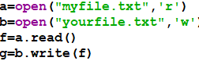
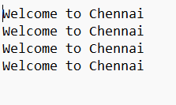
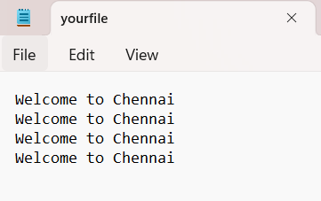

# copy-file
## AIM:
To write a python program for copying the contents from one file to another file.
## EQUIPEMENT'S REQUIRED: 
PC
Anaconda - Python 3.7
## ALGORITHM: 
### Step 1:

open the file myfile.txt in read mode
### Step 2:

open the file yourfile.txt in write mode
### Step 3:

read the file
### Step 4:

write the file into another file
### Step 5:

end the program
## PROGRAM:
```
Developed by:MANOJ KUMAR S
Reference no:212223240082
a=open("myfile.txt",'r')
b=open("yourfile.txt",'w')
f=a.read()
g=b.write(f)
```
## OUTPUT:
### output

### Text File

### copy file



## RESULT:
Thus the program is written to copy the contents from one file to another file.